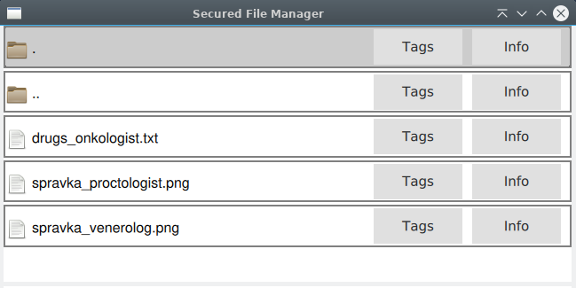
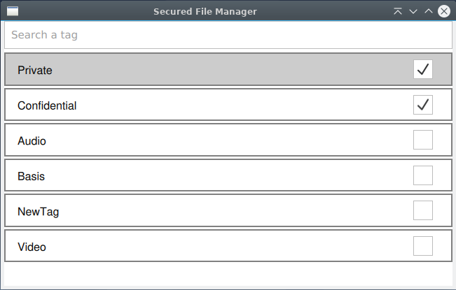

Secured File Manager
====================

**disclaimer**: TagSecFileManage right now is in a very early stage of development. You probably can't use it right now without modifying SELinux-tools.

TagSecFileManager is a file manager that allows users to make security labels for files.
It will allow users to easily and naturally protect their confidential data. It will work with SELinux and other security providers.
Here are confidential files:
  
and here are Security Tags setting dialog:

Now, only apps with the same tags as files can access those files.

